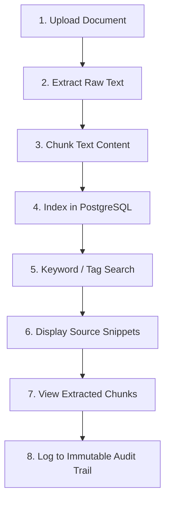
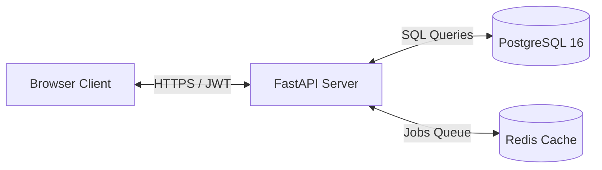
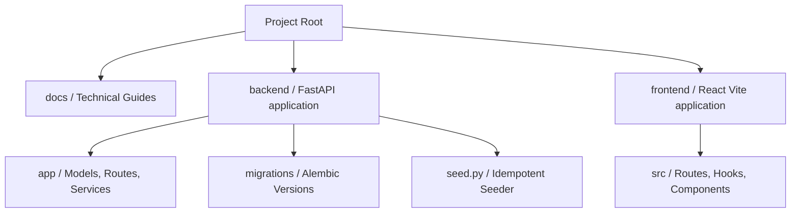

# KnowledgeFlow AI
### Enterprise Knowledge Management Platform

[](https://python.org)
[](https://fastapi.tiangolo.com)
[](https://react.dev)
[](https://typescriptlang.org)
[](https://postgresql.org)
[](https://docker.com)
[](https://jwt.io)
[](LICENSE)

KnowledgeFlow AI is a secure, portfolio-grade knowledge management platform that centralizes scattered business procedures, policies, and runbooks into indexable and searchable assets with audit logging and collection-level RBAC.

---

## 🏢 Business Problem

Organizations struggle with scattered, unstructured knowledge. Crucial information lives siloed across Employee Handbooks, HR Policies, IT Runbooks, Safety Procedures, Procurement Manuals, Quality Guidelines, and Vendor Agreements. 

This results in:
* **Wasted Time**: Employees spend hours searching across file shares and chat history.
* **Compliance Risks**: Lack of centralized, auditable version control leads to operators using outdated SOPs.
* **Security Gaps**: Sensitive financial or legal documents are shared without department-level boundaries.

**KnowledgeFlow AI** centralizes these assets, extracting text, splitting content into logical chunk citations, and providing fast keyword/metadata search under strict role-based governance.

---

## 🛠️ Key Features

* **Secure Authentication**: Signed JWT tokens with 8-hour expiration limits.
* **Role-Based Access Control (RBAC)**: Enforced scopes for `ADMIN`, `CONTENT_MANAGER`, and `EMPLOYEE`.
* **Dynamic Collections**: Group files under departmental folders with permission boundaries.
* **Version Control**: Auto-tracks document iterations and file updates.
* **Advanced Search**: Substring trigram matching across titles, tags, descriptions, and chunk texts.
* **Document Extraction**: Integrated parsing for `.pdf`, `.docx`, `.doc`, `.txt`, and `.md` files.
* **Logical Chunking**: splits text into paragraph-aligned chunks of ~750 characters with overlap.
* **Source Snippets**: Quotes matched content segments directly inside search result views.
* **Immutable Audit Trail**: Permanent logs of views, downloads, uploads, reindexing, and search terms.
* **Dashboard Indicators**: Total chunks, recently indexed files, storage limits, and unanswered queries.

---

## 🖼️ Screenshots

The user interface matches the premium Lovable UI layout:

| 🔐 User Onboarding | 📊 Analytics Center |
| :---: | :---: |
|  |  |
| **🔍 Search Snippets** | **📑 Segmented Preview** |
|  |  |

> [!NOTE]
> Screenshots are located in the [docs/images/](docs/images/) folder. Detailed browser specifications and camera orders are listed in the [Screenshots Guide](docs/screenshots.md).

---

## 🔄 Enterprise Ingestion Workflow



---

## 🏛️ System Architecture

KnowledgeFlow AI operates as a decoupled, multi-tier containerized stack:

* **Frontend**: React 18, Vite, TypeScript, TanStack Start, TailwindCSS.
* **Backend**: Python 3.11, FastAPI, SQLAlchemy 2.0, Alembic, Gunicorn.
* **Database**: PostgreSQL 16 (utilizing trigram indexing for high-speed keyword search).
* **Caching & Broker**: Redis 7.



For database schemas and ER diagrams, see the [Database Documentation](docs/database.md). For detailed service layouts, see the [Architecture Documentation](docs/architecture.md).

---

## 📁 Repository Layout



Detailed layout explanations are available in the [Architecture Guide](docs/architecture.md#folder-structure).

---

## 🚀 Installation & Onboarding

### Docker Compose Quickstart
To spin up the entire database, Redis, backend, and frontend stack in minutes:

1. Clone the repository:
   ```bash
   git clone https://github.com/Yashwant9871/knowledgeflow-ai.git
   cd knowledgeflow-ai
   ```
2. Copy environment configurations:
   ```bash
   cp .env.example .env
   ```
3. Run the container build:
   ```bash
   docker-compose up -d --build
   ```
4. Seed the database (runs migrations and processes 8 policy files automatically):
   ```bash
   docker exec -t knowledgeflow-backend python seed.py
   ```
5. Access the application:
   * **Frontend Interface**: `http://localhost:5173`
   * **API Swagger Documentation**: `http://localhost:8000/docs`

---

## 🔑 Demo Accounts

Use the password **`demo-password`** to log in to any of the seeded accounts:

| User | Email | Role | Accessible Collections |
| :--- | :--- | :---: | :--- |
| **Sarah Chen** | `sarah.chen@acme.com` | **ADMIN** | All Collections (Full Rights) |
| **Marcus Okafor** | `marcus.okafor@acme.com` | **CONTENT_MANAGER** | Human Resources, Legal |
| **Priya Raman** | `priya.raman@acme.com` | **CONTENT_MANAGER** | Operations, Safety, Quality |
| **Daniel Weiss** | `daniel.weiss@acme.com` | **EMPLOYEE** | Finance, Procurement |

---

## 🛠️ REST API Summary

| Method | Endpoint | Description | Auth Scope |
| :--- | :--- | :--- | :---: |
| `POST` | `/api/v1/auth/login` | Logs in and returns signed JWT | None |
| `GET` | `/api/v1/auth/me` | Returns current profile details | User |
| `GET` | `/api/v1/documents` | Searches matching titles and chunks | User |
| `POST` | `/api/v1/documents/upload` | Uploads multipart file and metadata | Content Manager / Admin |
| `POST` | `/api/v1/documents/{id}/reindex` | Retries text parsing and segmenting | Content Manager / Admin |
| `GET` | `/api/v1/documents/{id}/chunks` | Returns text chunk segments | User |
| `GET` | `/api/v1/audit` | Returns immutable logs of actions | Content Manager / Admin |
| `GET` | `/api/v1/analytics/dashboard` | Compiles real-time metrics | User |

> [!TIP]
> Read the complete endpoint specification, request body JSONs, and code details in the [API Documentation](docs/api.md).

---

## 🗺️ Project Roadmap

### Completed Features (v1.0.0)
* [x] FastAPI, PostgreSQL, and Redis backend infrastructure.
* [x] Alembic migration setup as database schema source of truth.
* [x] JWT token validation and RBAC guards (Admin, Content Manager, Employee).
* [x] PDF, DOCX, and Text extraction pipelines.
* [x] Paragraph-boundary respecting chunk segmentation.
* [x] Substring search matching with citation snippets.
* [x] Immutable activity logging and zero-result search gap identifiers.
* [x] Lovable UI frontend views and dashboard integrations.

### Future Enhancements (v2.0.0 Roadmap)
* [ ] **Vector Embeddings**: Set up `pgvector` in PostgreSQL to store dense representations.
* [ ] **Hybrid Search**: Merge trigram string searches with semantic vector distances.
* [ ] **RAG (Retrieval-Augmented Generation)**: Hook up LLM completion endpoints to return verified, citation-backed answers directly to users.

---

## 📜 License
This project is licensed under the terms of the **MIT License**.
