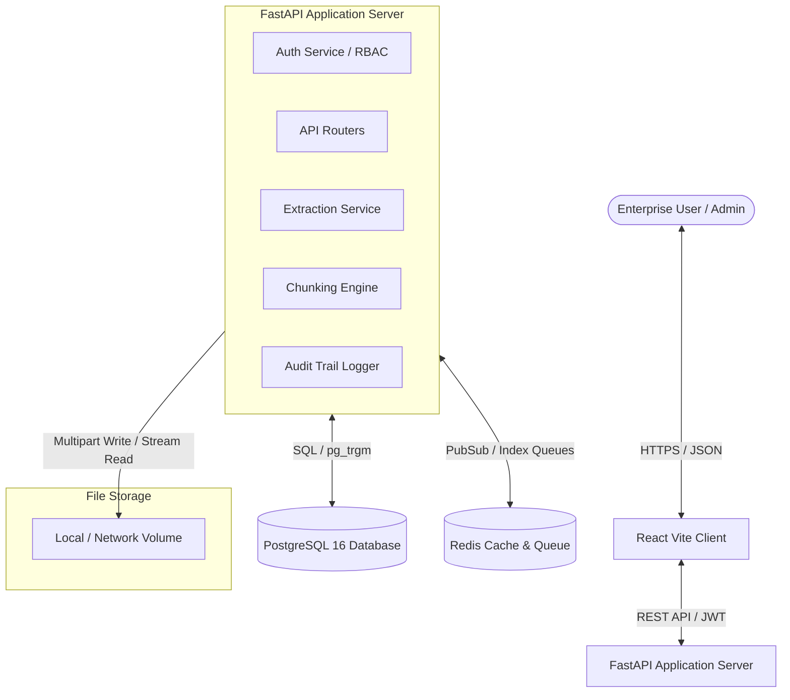
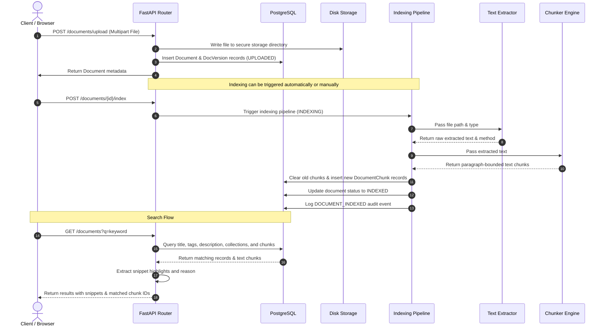

# Architecture Overview

This document details the high-level system architecture, component design, and integration layers of KnowledgeFlow AI.

## High-Level System Architecture

KnowledgeFlow AI is structured as a decoupled, multi-tier web application built for horizontal scalability, fast retrieval, and secure governance:

---

## Key System Components

### 1. Frontend Client Tier
* **Technology**: React 18, Vite, TypeScript, TanStack Start & React Router.
* **Responsibilities**:
  * Render the Lovable UI design system.
  * Manage JWT storage (`localStorage`) and inject bearer credentials into API request headers.
  * Handle client-side routing, filtering (by collection, department, file type, or tags), and dashboard metrics rendering.
  * Enforce UI-level RBAC (hiding administration controls or reindex actions from Employee accounts).

### 2. Backend Application Tier
* **Technology**: Python 3.11, FastAPI, SQLAlchemy 2.0, Alembic, python-jose, bcrypt.
* **Responsibilities**:
  * **REST API**: Exposes versioned endpoints (`/api/v1`) for authentication, metadata retrieval, auditing, collections management, and file streams.
  * **Security & RBAC**: Decodes JWTs, validates scopes, and checks user rights via parameterized FastAPI dependency injectors.
  * **Text Extraction Service**: Traps PDF, Word, and text file uploads, extracting raw text and reporting compatibility metrics.
  * **Chunking Engine**: Segments raw text into paragraph-bounded units for precise citation searching.
  * **Audit Layer**: Generates immutable audit events (such as logins, views, downloads, uploads, reindexing, or zero-result searches).

### 3. Database Tier
* **Technology**: PostgreSQL 16.
* **Responsibilities**:
  * Acts as the single source of truth for schemas, migrations, metadata, and chunk text.
  * Implements `pg_trgm` (trigram) indexes for fast keyword search across large text documents without requiring heavy external search servers (e.g. Elasticsearch).

### 4. Cache & Queue Tier
* **Technology**: Redis 7.
* **Responsibilities**:
  * Configured as the message broker for future asynchronous worker engines.
  * Tracks processing statuses and job coordinates.

---

## Data Pipeline Flow (Upload to Indexed Search)

The sequence diagram below displays the ingestion, parsing, chunking, database mapping, and search retrieval lifecycle:

