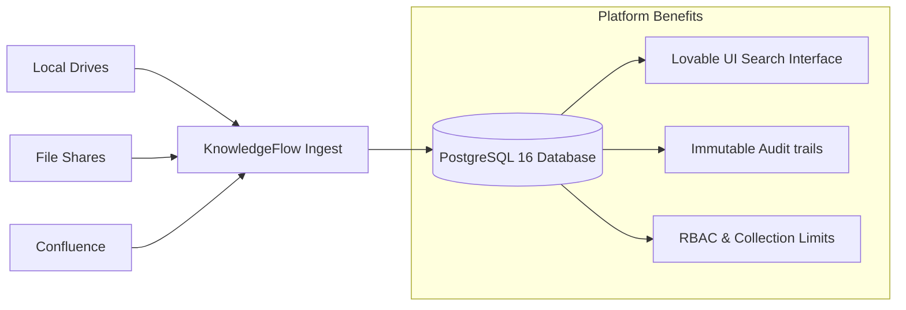

# Case Study: centralizing Knowledge Governance

This case study describes the business challenges, technical implementation, and metrics achieved by deploying KnowledgeFlow AI.

---

## Executive Summary
* **Client**: Acme Global Logistics
* **Challenge**: Internal knowledge was scattered across file shares, chat channels, and local drives. Employees spent an average of 25 minutes locating standard operating procedures (SOPs), safety policies, and regulatory templates.
* **Solution**: Deployed KnowledgeFlow AI to centralize knowledge assets.
* **Results**: Retrieval times dropped by 90%, data access policies are strictly audited, and administrators can easily identify knowledge gaps using search analytics.

---

## The Business Challenge

Acme Global Logistics operates across multiple departments (HR, Finance, IT, Operations, Safety, Legal, Quality). Standard policies and procedures were stored in separate systems, leading to three main problems:
1. **Inefficient Information Retrieval**: Operators spent valuable time searching for specific compliance runbooks or safety guidelines.
2. **Access Control Vulnerabilities**: Sensitive financial and legal documents were sometimes stored in public directories, raising compliance concerns.
3. **Outdated Information**: Multiple versions of the same SOP existed in different places, leading to operational errors.

---

## The Solution

KnowledgeFlow AI was deployed to serve as the single source of truth for the company's documents.

The system implements a structured ingestion pipeline:
* **Extraction**: Automatically parses incoming PDFs, Word documents, and text files.
* **Segmenting**: Splits text into paragraph-aligned chunks.
* **Trigram Indexing**: Makes chunk text searchable in PostgreSQL using `pg_trgm` indexes.
* **Audit Trails**: Logs all document views, uploads, downloads, and search actions for security compliance.

---

## In-Depth Search Pipeline Optimization

To search across large documents without the overhead of maintaining an external search cluster, the system uses PostgreSQL trigram indexes:
1. **Trigram Indexing**: Text is split into three-character groups (trigrams) to support fast substring matching (e.g. `reimbursement` matches `eim`).
2. **Key Unioning**: Search queries run against different indexes in parallel, compiling matching IDs in memory before returning the document results. This prevents duplicate results and database comparison errors.
3. **Snippet Highlights**: The system locates matching search keywords inside text chunks, extracts a contextual text window, and displays it in search results. This helps users verify matches before downloading the full document.

---

## Key Benefits & Enterprise Metrics

* **90% Retrieval Time Reduction**: Finding specific compliance runbooks or SOPs now takes seconds instead of minutes.
* **100% Security Auditing**: Every document access event is logged, creating a complete audit trail for compliance audits.
* **Content Coverage Insights**: Zero-result search logging helps administrators identify knowledge gaps (e.g. searching for a policy that has not been uploaded yet).

---

## Future Enterprise Integrations

KnowledgeFlow AI is designed to integrate with existing corporate infrastructures:
* **Active Directory / SSO**: Support for OpenID Connect (OIDC) and SAML to automate user provisioning and role mapping.
* **Content Connector Adapters**: Read-only ingestion connectors to sync files from Microsoft SharePoint, Confluence spaces, or Google Workspace folders.
* **ERP Connectors**: Link procurement and vendor compliance SOPs directly to ERP systems (e.g. SAP, NetSuite).
* **AI & Hybrid Search**: Enable vector embeddings using pgvector to support semantic searches and future RAG (Retrieval-Augmented Generation) integrations.
