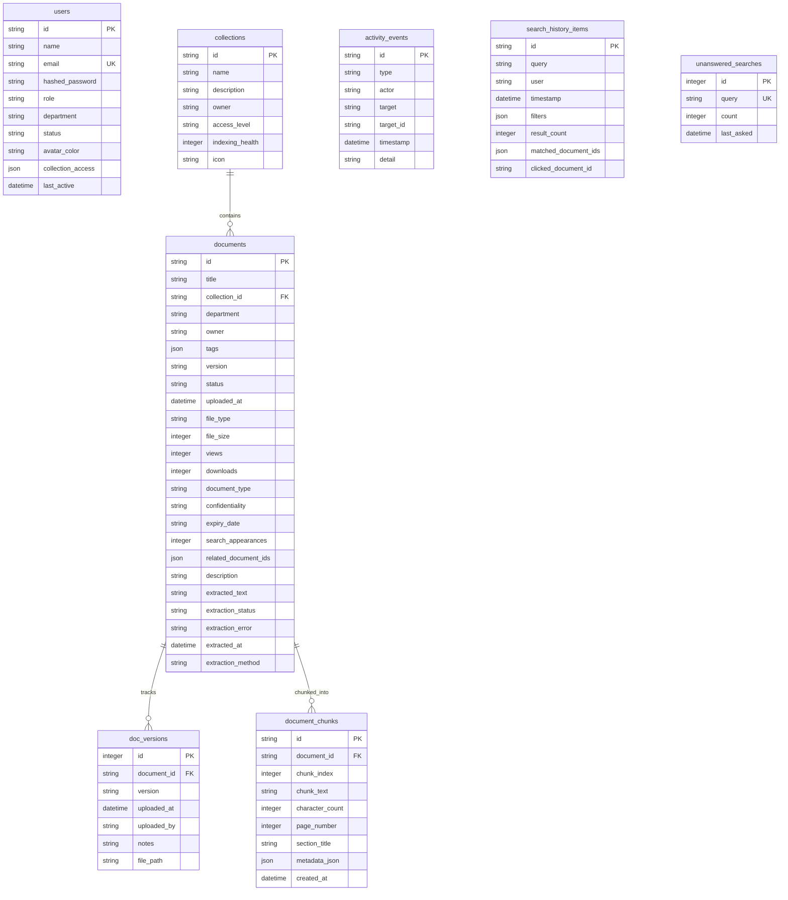

# Database Schema & Models

This document describes the PostgreSQL database schema, data models, table fields, constraints, indexes, and entity relationships.

## Entity Relationship Diagram (ERD)

The diagram below represents the core database models and how they relate:

---

## Tables Reference

### 1. `users`
Stores employee profiles, authentication details, role tiers, and access credentials.

| Column | Type | Constraints | Description |
| :--- | :--- | :--- | :--- |
| `id` | `VARCHAR` | Primary Key | Unique user identifier (e.g. `u1`). |
| `name` | `VARCHAR` | Not Null | Full name of the user. |
| `email` | `VARCHAR` | Unique, Index, Not Null | Unique corporate email address. |
| `hashed_password`| `VARCHAR` | Not Null | Bcrypt hashed password. |
| `role` | `VARCHAR` | Not Null | RBAC tier: `ADMIN`, `CONTENT_MANAGER`, `EMPLOYEE`. |
| `department` | `VARCHAR` | Not Null | User department (e.g. `HR`, `Finance`). |
| `status` | `VARCHAR` | Not Null | Account status: `ACTIVE`, `INVITED`, `SUSPENDED`. |
| `avatar_color` | `VARCHAR` | Default `'265'` | Hue value for UI avatar coloring. |
| `collection_access`| `JSON` | Default `[]` | List of collection IDs the user has explicit access to. |
| `last_active` | `TIMESTAMP` | Default `utcnow` | Time of last API interaction. |

* **Indexes**: Unique index on `email` (lowercased).

### 2. `collections`
Groups related knowledge documents under permission-controlled containers.

| Column | Type | Constraints | Description |
| :--- | :--- | :--- | :--- |
| `id` | `VARCHAR` | Primary Key | Unique container ID (e.g. `c-hr`). |
| `name` | `VARCHAR` | Not Null | Name of the collection. |
| `description` | `TEXT` | Nullable | Detailed description of collection scope. |
| `owner` | `VARCHAR` | Not Null | Full name of the collection owner. |
| `access_level` | `VARCHAR` | Not Null | Security classification: `OPEN`, `DEPARTMENT`, `RESTRICTED`. |
| `indexing_health` | `INTEGER` | Default `100` | Percentage of files successfully indexed. |
| `icon` | `VARCHAR` | Default `'folder'` | Lucide icon name for UI rendering. |

### 3. `documents`
Stores document metadata, processing status, and extracted text content.

| Column | Type | Constraints | Description |
| :--- | :--- | :--- | :--- |
| `id` | `VARCHAR` | Primary Key | Unique document identifier (e.g. `d1`). |
| `title` | `VARCHAR` | Not Null | Document title. |
| `collection_id` | `VARCHAR` | Foreign Key (collections) | Containing collection. |
| `department` | `VARCHAR` | Not Null | Governed department. |
| `owner` | `VARCHAR` | Not Null | Content author. |
| `tags` | `JSON` | Default `[]` | Categorization tags list. |
| `version` | `VARCHAR` | Default `'1.0'` | Current version identifier. |
| `status` | `VARCHAR` | Default `'UPLOADED'` | Pipeline status: `UPLOADED`, `INDEXING`, `INDEXED`, `INDEXING_FAILED`, `NEEDS_REVIEW`, `ARCHIVED`. |
| `uploaded_at` | `TIMESTAMP` | Default `utcnow` | Date uploaded. |
| `file_type` | `VARCHAR` | Not Null | File extension (e.g. `PDF`, `DOCX`, `TXT`). |
| `file_size` | `INTEGER` | Default `0` | File size in bytes. |
| `views` | `INTEGER` | Default `0` | Number of document views. |
| `downloads` | `INTEGER` | Default `0` | Number of downloads. |
| `document_type` | `VARCHAR` | Default `'Document'` | Type category (e.g. `SOP`, `Runbook`, `Contract`). |
| `confidentiality`| `VARCHAR` | Default `'INTERNAL'`| Classification: `PUBLIC`, `INTERNAL`, `CONFIDENTIAL`, `RESTRICTED`. |
| `expiry_date` | `VARCHAR` | Nullable | Document review or expiration date. |
| `search_appearances`| `INTEGER` | Default `0` | Number of times returned in search queries. |
| `related_document_ids`| `JSON` | Default `[]` | References to associated document IDs. |
| `description` | `TEXT` | Nullable | Dynamic summary preview. |
| `extracted_text` | `TEXT` | Nullable | Extracted raw text. |
| `extraction_status`| `VARCHAR` | Default `'PENDING'` | Status: `PENDING`, `EXTRACTING`, `EXTRACTED`, `FAILED`. |
| `extraction_error`| `TEXT` | Nullable | Captured exception stack trace. |
| `extracted_at` | `TIMESTAMP` | Nullable | Ingestion completion timestamp. |
| `extraction_method`| `VARCHAR` | Nullable | Engine: `PYPDF_EXTRACTOR`, `PYTHON_DOCX_EXTRACTOR`, `UTF8_TEXT_EXTRACTOR`. |

* **Indexes**: 
  * Index on `collection_id` (foreign key performance).
  * Index on `status` (dashboard aggregation performance).
  * Trigram index on `title` and `extracted_text` for keyword query lookup.

### 4. `doc_versions`
Retains version history and file paths.

| Column | Type | Constraints | Description |
| :--- | :--- | :--- | :--- |
| `id` | `INTEGER` | Primary Key, Serial | Autoincrement version row PK. |
| `document_id` | `VARCHAR` | Foreign Key (documents) | Parent document record. |
| `version` | `VARCHAR` | Not Null | Version tag (e.g. `1.1`). |
| `uploaded_at` | `TIMESTAMP` | Default `utcnow` | Upload timestamp. |
| `uploaded_by` | `VARCHAR` | Not Null | Username of uploader. |
| `notes` | `VARCHAR` | Nullable | Release/change log notes. |
| `file_path` | `VARCHAR` | Nullable | Physical disk storage absolute path. |

### 5. `document_chunks`
Stores segmented paragraphs for fine-grained text matching.

| Column | Type | Constraints | Description |
| :--- | :--- | :--- | :--- |
| `id` | `VARCHAR` | Primary Key | Unique chunk ID (e.g. `c-abcdef12`). |
| `document_id` | `VARCHAR` | Foreign Key (documents) | Parent document. |
| `chunk_index` | `INTEGER` | Not Null | Ordered segment index (0-indexed). |
| `chunk_text` | `TEXT` | Not Null | Segment text contents. |
| `character_count`| `INTEGER` | Not Null | Length of `chunk_text`. |
| `page_number` | `INTEGER` | Nullable | Document page index (if parsed). |
| `section_title` | `VARCHAR` | Nullable | Identified header/title. |
| `metadata_json` | `JSON` | Default `{}` | Additional parsing context. |
| `created_at` | `TIMESTAMP` | Default `utcnow` | Ingestion timestamp. |

* **Indexes**:
  * Index on `document_id` (cascading deletes and details loading).
  * Trigram index on `chunk_text` for matching keywords inside segments.

### 6. `activity_events`
Immutable security and operation logs (Audit Trail).

| Column | Type | Constraints | Description |
| :--- | :--- | :--- | :--- |
| `id` | `VARCHAR` | Primary Key | Unique log ID. |
| `type` | `VARCHAR` | Not Null | Event code (e.g. `DOCUMENT_INDEXED`, `LOGIN`). |
| `actor` | `VARCHAR` | Not Null | Username or trigger name. |
| `target` | `VARCHAR` | Not Null | Target identifier. |
| `target_id` | `VARCHAR` | Nullable | Target database primary key. |
| `timestamp` | `TIMESTAMP` | Default `utcnow` | Event time. |
| `detail` | `VARCHAR` | Nullable | Extended log details. |

### 7. `search_history_items`
Tracks queries and clicked results to feed analytics.

| Column | Type | Constraints | Description |
| :--- | :--- | :--- | :--- |
| `id` | `VARCHAR` | Primary Key | Unique query log ID. |
| `query` | `VARCHAR` | Not Null | Searched keywords. |
| `user` | `VARCHAR` | Not Null | Username of searcher. |
| `timestamp` | `TIMESTAMP` | Default `utcnow` | Query time. |
| `filters` | `JSON` | Default `{}` | Active department, collection, type filters. |
| `result_count` | `INTEGER` | Not Null | Number of matches returned. |
| `matched_document_ids`| `JSON` | Default `[]` | List of matching document IDs. |
| `clicked_document_id`| `VARCHAR` | Nullable | Selected document detail click-through. |

### 8. `unanswered_searches`
Aggregates queries returning zero results (Knowledge Gaps).

| Column | Type | Constraints | Description |
| :--- | :--- | :--- | :--- |
| `id` | `INTEGER` | Primary Key, Serial | Autoincrement PK. |
| `query` | `VARCHAR` | Unique, Not Null | Query returning 0 matches. |
| `count` | `INTEGER` | Default `1` | Count of identical queries. |
| `last_asked` | `TIMESTAMP` | Default `utcnow` | Last time queried. |
