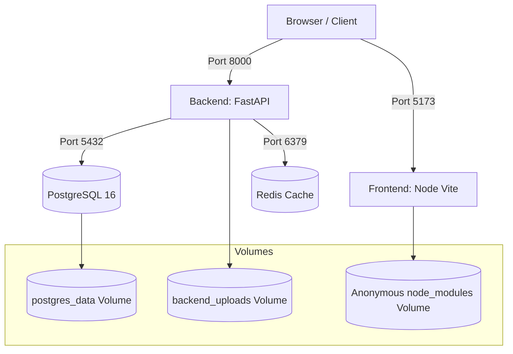

# Deployment & Infrastructure Guide

This document describes how to deploy KnowledgeFlow AI in local development and production environments.

## Docker Compose Orchestration

The application uses Docker Compose to manage the system containers:



---

## Environment Variables

The application is configured using environment variables. Below is the configurations checklist:

| Variable | Scope | Default | Description |
| :--- | :--- | :--- | :--- |
| `DATABASE_URL` | Backend | `postgresql://postgres:postgres@db:5432/knowledgeflow` | Connection string for PostgreSQL database. |
| `REDIS_URL` | Backend | `redis://redis:6379/0` | Connection string for Redis cache. |
| `UPLOAD_DIR` | Backend | `uploads` | Directory where uploaded files are stored on disk. |
| `DEMO_AUTO_MIGRATION` | Backend | `true` | Runs alembic migrations automatically on container startup. |
| `SECRET_KEY` | Backend | `keep-this-secret-and-secure` | Salt used to sign JWT authentication tokens. |
| `ACCESS_TOKEN_EXPIRE_MINUTES` | Backend | `480` | JWT token expiration time (default 8 hours). |
| `VITE_API_URL` | Frontend | `http://localhost:8000` | Target URL of the backend application server. |

---

## Production Configurations

### 1. Reverse Proxy (TLS / HTTPS Termination)
In production, do not expose backend and frontend ports directly. Use a reverse proxy (such as Nginx or Caddy) to handle HTTPS certificates:

**Nginx Configuration snippet**:
```nginx
server {
    listen 443 ssl;
    server_name knowledgeflow.acme.com;

    ssl_certificate /etc/letsencrypt/live/knowledgeflow/fullchain.pem;
    ssl_certificate_key /etc/letsencrypt/live/knowledgeflow/privkey.pem;

    # Static Frontend
    location / {
        proxy_pass http://localhost:5173;
        proxy_set_header Host $host;
        proxy_set_header X-Real-IP $remote_addr;
    }

    # API Backend
    location /api {
        proxy_pass http://localhost:8000;
        proxy_set_header Host $host;
        proxy_set_header X-Real-IP $remote_addr;
        client_max_body_size 50M; # Match upload limits
    }
}
```

### 2. Persistent Storage & Backups
* **File Uploads Volume**: Mount the uploads directory to a shared block storage volume (e.g. AWS EFS or Azure Files) if scaling to multiple backend containers.
* **Database Backups**: Set up a daily cron job to dump database contents:
  ```bash
  docker exec -t knowledgeflow-db pg_dump -U postgres knowledgeflow > /backups/db_$(date +%F).sql
  ```

### 3. Alembic Migrations in Production
Do not set `DEMO_AUTO_MIGRATION=true` in production containers. Run migrations manually during deployments:
```bash
docker exec -t knowledgeflow-backend alembic upgrade head
```
This isolates migration failures from application start-up processes.
