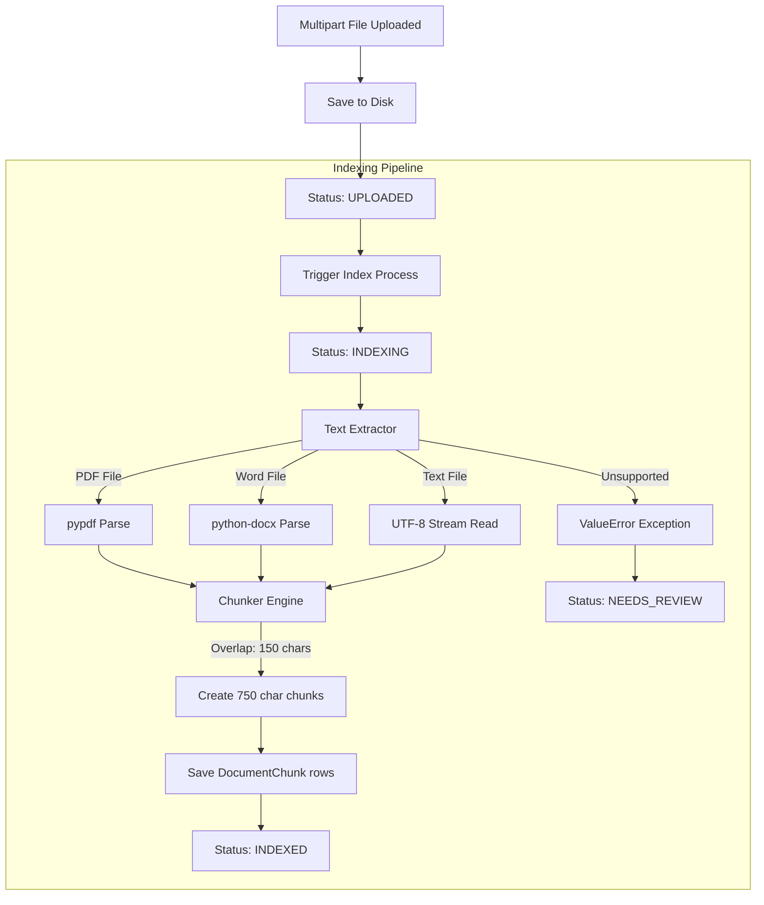
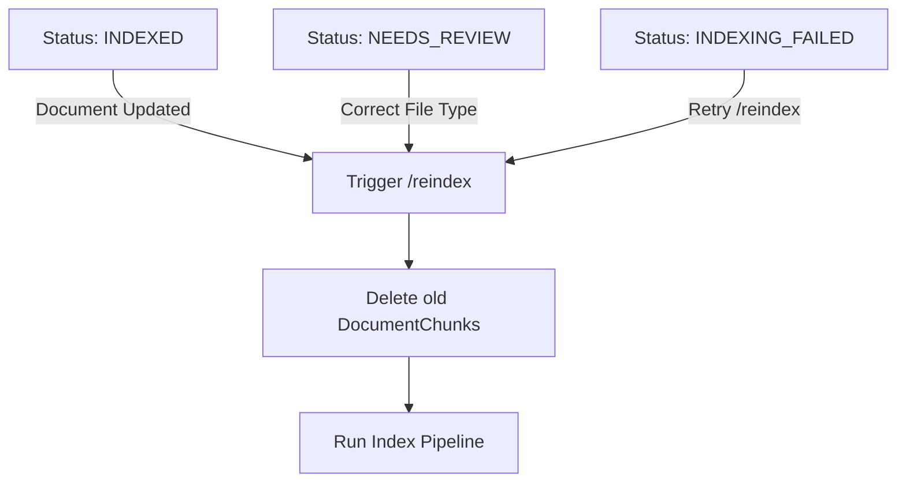

# Document Indexing Pipeline

This document explains the text parsing engines, chunking algorithms, pipeline statuses, failure mitigation, and reindexing routines.

## Indexing Engine Overview

The ingestion engine processes files uploaded to `uploads/`, extract text, split it into segments, and update the database:

---

## Supported File Extensions & Parsers

* **PDF (`.pdf`)**: Parsed page-by-page using `pypdf`. Extracts text and retains page-level metadata.
* **Word (`.docx`, `.doc`)**: Segmented paragraph-by-paragraph using `python-docx`.
* **Markdown (`.md`)**: Read as a plain text stream, preserving paragraph headings.
* **Text / CSV / JSON (`.txt`, `.csv`, `.json`)**: Read as plain UTF-8 streams.

---

## Chunking Parameters

To ensure segments are small enough to provide precise citations and large enough to retain context:
* **Target Chunk Size**: ~750 characters.
* **Character Overlap**: ~150 characters.
* **Preservation**: The chunker splits text by paragraphs (`\n`). If a single paragraph is longer than 750 characters, it splits the text at sentence boundaries. Small trailing fragments are merged into the previous chunk.

---

## Status Indicators & Transitions

* **`UPLOADED`**: Document metadata is recorded, but the file has not been parsed.
* **`INDEXING`**: The ingestion pipeline is active.
* **`INDEXED`**: Extraction and chunking completed successfully. The document is fully searchable.
* **`NEEDS_REVIEW`**: Extraction failed due to an unsupported file format or verification error. Requires administrative review.
* **`INDEXING_FAILED`**: The ingestion pipeline encountered a system exception (e.g. corrupt file, disk read failure).

---

## Failure Mitigation & Reindexing Flow

* **Clear Chunks**: Reindexing deletes all existing `document_chunks` records for the target document to prevent duplicate search results.
* **Reindex Audit**: Reindexing writes a `DOCUMENT_REINDEXED` audit event, capturing the actor user ID and time.
* **Access Control**: Triggering `/index` or `/reindex` requires `ADMIN` or `CONTENT_MANAGER` roles.
