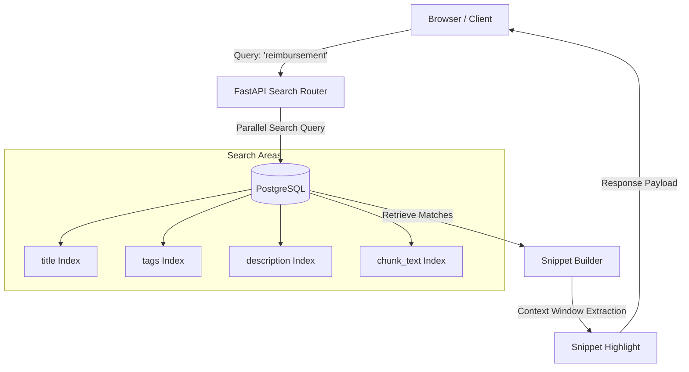

# Enterprise Search & Snippet Matching

This document explains the search architecture, index configurations, matching criteria, dynamic snippet highlighting, and analytics logging.

## Search Engine Overview

KnowledgeFlow AI implements a secure, keyword-based search engine directly inside PostgreSQL. It utilizes the `pg_trgm` (trigram) extension to perform fast pattern matching across structured fields and raw document chunks:



---

## Indexing Schema Configurations

To ensure fast response times across thousands of document text segments, PostgreSQL uses trigram indexes:

```sql
-- Enable trigram extension
CREATE EXTENSION IF NOT EXISTS pg_trgm;

-- Create GIN index on document title
CREATE INDEX IF NOT EXISTS idx_doc_title_trgm ON documents USING gin (title gin_trgm_ops);

-- Create GIN index on document description
CREATE INDEX IF NOT EXISTS idx_doc_desc_trgm ON documents USING gin (description gin_trgm_ops);

-- Create GIN index on text chunks
CREATE INDEX IF NOT EXISTS idx_chunk_text_trgm ON document_chunks USING gin (chunk_text gin_trgm_ops);
```

---

## Snippet Highlighting & Match Reasons

When a user submits a search query, the system identifies the matching document and calculates a context snippet to show the match context.

### Snippet Generation Logic

1. **Title Match**:
   * **Reason**: `Title match`
   * **Snippet**: `Title contains match: [Document Title]`
2. **Tag Match**:
   * **Reason**: `Tag match`
   * **Snippet**: `Matches tag: [Tag name]`
3. **Description Match**:
   * **Reason**: `Metadata match`
   * **Snippet**: Returns the document description summary.
4. **Content Match (Chunks)**:
   * **Reason**: `Content match (Chunk #[Index])`
   * **Context Window**: Locates the matching keyword in the chunk, extracts a window (up to 45 characters before and 55 characters after the match), and wraps it with ellipsis (`...`).
   * **Snippet**: `...[45 chars] [keyword] [55 chars]...`

---

## Zero-Result Logging & Knowledge Gaps

If a query returns no matching documents across any index:
1. **Search History Event**: A query history entry is written with `result_count = 0`.
2. **Unanswered Search Log**: The system logs the event in the `unanswered_searches` table or increments the query counter if it was searched before.
3. **Audit Event**: Logs `SEARCH_ZERO_RESULTS`.

Admins can access this dashboard metrics summary to identify knowledge gaps and assign content writers to upload missing SOPs or procedures.

---

## Future Roadmap: Hybrid Semantic Search

While Phase 2 is strictly keyword-based, the schema is designed for future semantic search upgrades:
* **Vector Store**: Introduce `pgvector` extension to run alongside the relational database.
* **Embeddings**: Generate dense vectors using OpenAI `text-embedding-3-small` or HuggingFace model architectures.
* **Hybrid Search**: Combine trigram keyword search with vector cosine distance similarity metrics.
