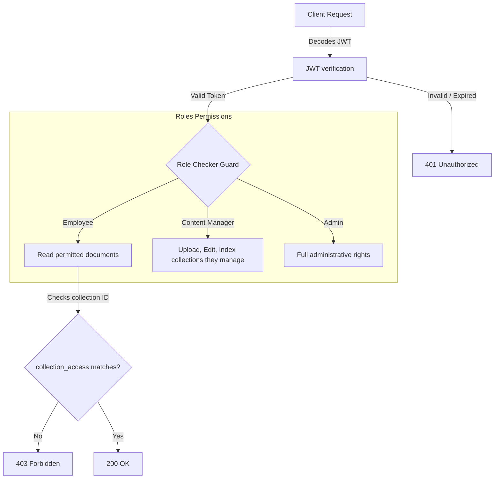

# Security & Governance

This document describes the security policies, authentication mechanisms, role definitions, and document governance controls implemented in KnowledgeFlow AI.

## Security Architecture

The application enforces a zero-trust model for data access. Every request to the document repository requires authorization:

---

## Key Security Controls

### 1. JWT Authentication
* **Hashing Algorithm**: User passwords are encrypted using `bcrypt` with a work factor of 12.
* **Token Protocol**: Authentication tokens are signed using the `HMAC-SHA256` signature algorithm.
* **Token Expiration**: Signed tokens expire after 8 hours (480 minutes) by default to balance security and usability.
* **Extraction Security**: Tokens can be sent via standard `Authorization: Bearer <token>` headers or via the `token` URL query parameter (for direct browser file downloads).

---

### 2. Role-Based Access Control (RBAC)

Below is the permissions matrix for each user tier:

| Action / Endpoint | Employee | Content Manager | Administrator |
| :--- | :---: | :---: | :---: |
| Login / Me Profile | ✓ | ✓ | ✓ |
| Search / List Documents | ✓ (Filtered) | ✓ | ✓ |
| View / Download Permitted Files | ✓ | ✓ | ✓ |
| Upload Documents | ✗ | ✓ | ✓ |
| Edit Document Metadata | ✗ | ✓ | ✓ |
| Archive Documents | ✗ | ✓ | ✓ |
| Trigger Indexing / Reindexing | ✗ | ✓ (Managed) | ✓ |
| Read Audit Log Trail | ✗ | ✓ | ✓ |
| View / Invite Users | ✗ | ✗ | ✓ |
| Read / Edit Global Settings | ✗ | ✗ | ✓ |

* **Violations**: Unauthorized requests to guarded endpoints automatically return an HTTP `403 Forbidden` response.

---

### 3. Collection-Level Permissions
Even if authenticated, non-ADMIN users can only query or download documents belonging to collections listed in their user profile `collection_access` array:
* When an Employee runs a search query, the backend filters SQL results: `WHERE collection_id IN (user.collection_access)`.
* When fetching document chunks or details, the backend performs a check: `assert doc.collection_id in user.collection_access` and throws 403 if it fails.

---

### 4. Secure File Ingestion Validation
To prevent system exploitation, the file upload endpoint `/api/v1/documents/upload` implements four layers of validation:
1. **Size Verification**: The file stream length is checked on download. Uploads exceeding 50MB are aborted.
2. **Type Allowlist**: Only files with extensions `.pdf`, `.docx`, `.doc`, `.txt`, `.md`, `.csv`, and `.json` are accepted.
3. **Filename Sanitization**: Input file names are regex-cleaned: only alphanumeric characters, dots, dashes, and underscores are allowed.
4. **Directory Traversal Defense**: The system verifies that the target write path stays strictly inside the configured `uploads/` directory.

---

### 5. Audit Logging
Every access change, indexing trigger, search history event, and download logs an entry in `activity_events` containing the action, actor username, and timestamp.
* **Write-Only Policy**: No API exists to delete or modify audit trails.
* **Zero-Result Logging**: Searches returning no results write a record containing the keyword query. This helps administrators identify content gaps.
