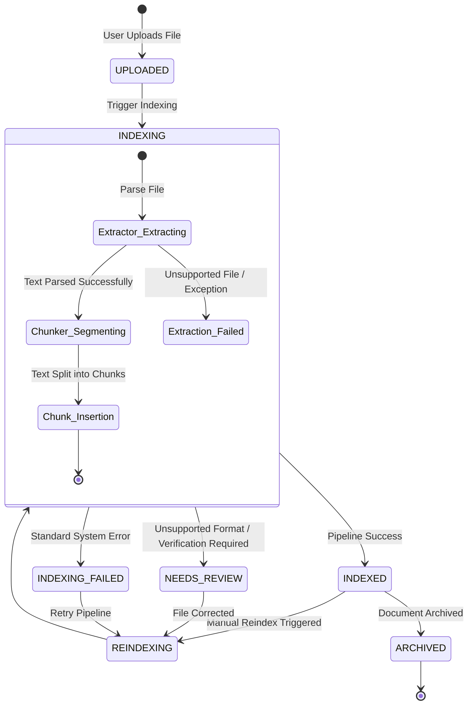

# Document Lifecycle & Workflow

This document explains the document lifecycle, status transitions, extraction pipeline stages, and the auditing mechanisms.

## Workflow Overview

KnowledgeFlow AI manages document ingestion, parsing, chunking, security auditing, and retrieval:



---

## Ingestion & Pipeline Stages

### 1. Document Upload
* **Action**: User packages metadata (title, collection, department, tags) and uploads a file via a multipart POST request to `/api/v1/documents/upload`.
* **Verification**: Files are validated against:
  * **Size cap**: Max 50MB.
  * **Extensions**: Must be PDF, DOCX, TXT, MD, CSV, or JSON.
  * **Filename**: Regex-cleaned to block directory traversal attacks (`../`).
* **State**: The database record is written, the file is saved to storage, and status transitions to `UPLOADED`. An audit trail event is logged: `UPLOAD`.

### 2. Ingestion & Text Extraction
* **Action**: The indexing pipeline reads the file from disk using the appropriate file parser:
  * PDF: Page reader extracts text.
  * Word: Paragraph aggregator extracts paragraphs.
  * Text/Markdown: UTF-8 stream reader reads raw files.
* **State**: Status moves to `INDEXING`. If extraction fails:
  * Due to unsupported file type: Document moves to `NEEDS_REVIEW` and logs `DOCUMENT_TEXT_EXTRACTION_FAILED`.
  * Due to parse exception (corrupt file, locked file): Document moves to `INDEXING_FAILED`.

### 3. Chunk Segmenting
* **Action**: Extracted text is segmented into paragraph-aligned chunks of ~750 characters with a ~150-character overlap.
* **State**: Previous chunks are cleared, and new `DocumentChunk` records are written to PostgreSQL. Logs `DOCUMENT_CHUNKS_CREATED`.

### 4. Index Success
* **Action**: Updates document status to `INDEXED`.
* **State**: Logs `DOCUMENT_INDEXED`. The asset is now searchable.

---

## Audit Logs Verification

Every transition, search request, and administrative action writes an immutable record to the `activity_events` database:

```mermaid
graph LR
    Actor[User / Worker] --> |Triggers Action| Action[API / Pipeline]
    Action --> |Write Audit Log| Log[(activity_events)]
    
    subgraph Audit Codes
        Log1[DOCUMENT_INDEXING_STARTED]
        Log2[DOCUMENT_TEXT_EXTRACTED]
        Log3[DOCUMENT_TEXT_EXTRACTION_FAILED]
        Log4[DOCUMENT_CHUNKS_CREATED]
        Log5[DOCUMENT_INDEXED]
        Log6[DOCUMENT_INDEXING_FAILED]
        Log7[DOCUMENT_REINDEXED]
        Log8[SEARCH_PERFORMED]
        Log9[SEARCH_ZERO_RESULTS]
    end
    Log -.-> Audit Codes
```
* **Immutability**: Audit logs are write-only. There are no exposed DELETE or UPDATE endpoints for `activity_events` tables.
* **Metadata captured**: User ID, document ID, file type, file size, extraction method, generated chunk count, and exception details (if failed).
* **Analytics aggregation**: Unanswered searches and trending keywords are compiled from these events.
